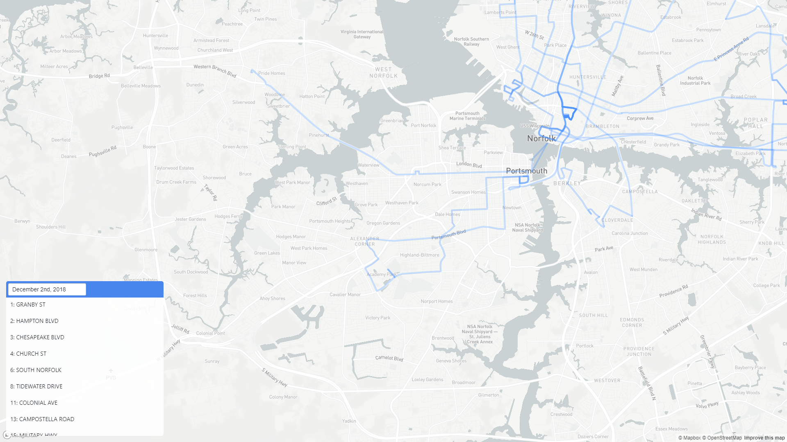

# Cavalier Bus

## Description

This application was created for the Fall 2018 section of SLS 3110: Technology and Sustainability Communities at Georgia Tech, working closely with [Garry A. Harris](https://csc-atl.org/about-us/garry-a-harris/), the President of the [Center for Sustainable Communities](https://csc-atl.org/), to help make Cavalier Manor, a community within the City of Portsmouth, VA, an [EcoDistrict](https://ecodistricts.org/).

This project takes the [General Transit Feed Specification](https://developers.google.com/transit/gtfs/) by Google and displays an interactive map with routes and stops, allowing community members and newcomers alike to visualize the bus system and discover the reach of the system. In theory, this application can handle any GTFS static feed for any transit system; however, this functionality has not been tested.

This project was bootstrapped with [Create React App](https://github.com/facebook/create-react-app).

## Current Features

- View all routes of a transit system
- Select a route on the map screen and view in isolation
- View all stops of a transit system
- Select a route number from a list and view that route in isolation
- Change service date to view different services for weekends and holidays.

## Potential Additions

- Show schedules for individual bus stops
- Show schedules for individual buses
- Show realtime bus data
- Show stops only for one route when route is selected
- Check what services are available based on time of day
    - Useful for late-night services or rush-hour only services.
- Automatically group close bus stops as transfer stations
- Make the application more mobile friendly.
- Create a client-server system
    - The application loads and stores everything on the client, which would be incredibly slow on mobile devices
- Integration with goHRT website
    - Allow for more route information from the goHRT webiste when you click on a route

## Screenshots

## Development

In order to develop this application, you will need experience with HTML, CSS, Javascript and ReactJS.

If you are interested in the code layout and flow:
- The application uses data from the goHRT GTFS, and the text files for the GTFS can be found in /src/gtfs. Updating these files will update the application’s routes, stops, and service dates. The GTFS is the same system that Google Maps uses to update its maps with transit information from agencies worldwide.
- The entire application is currently contained within App.js and is written as a single component application.
- The canonical state contains information fetched from the text files supplied from the GTFS files along with the selected route and highlighted route.
    - The canonical state reflects the format of the GTFS as closely as possible, with dictionaries in place for each file. The key is usually the ID with the value being an object containing the relevant data from that GTFS file.
    - The canonical state also contains the map state, where changing the values changes how the map looks and behaves, animating changes if the state changes.
    - Routes and bus stops are generated from the canonical state within the Map component.
- The application uses MapBox as an alternative to Google Maps for its continuous zoom, friendly pricing strategies, and integration with React.
- The application, messily, uses a combination of inline CSS and external stylesheets.
    - The application also makes use of the BlueprintJS Date and Time component developed by Palantir.

## Deployment

Building and deploying the application is slightly involved and requires some development experience and basic knowledge of web servers due to billing related to the use of maps.

### In order to build the application:
1. Ensure you have NodeJS and npm installed.
2. Clone this GitHub repository to some accessible location on your computer.
3. Find the .env.example file in the root directory
    - Duplicate the file and call the file .env
    - Create a MapBox API key.
        - The API key should begin with ‘pk.’
    - Paste your API key into the .env file you duplicated earlier in the field labeled REACT_APP_MAPBOX_API_KEY=
4. Make sure the /src/gtfs folder is up to date with the latest GTFS from goHRT.
5. Install all the dependencies by typing npm install.
6. Make sure your API key works by typing npm start.
    - If the map does not show up, that likely means your API key is not valid.
    - Check the console to see if there are any errors.
7. Type npm run build to create static HTML, CSS, and JS files to host on a web server.
    - This will put the finished build in the /build folder.

### In order to deploy the application:
Place the contents of the build folder on any web server and serve those files like you would any other HTML-based website.

## Available Scripts

In the project directory, you can run:

### `npm start`

Runs the app in the development mode. 
Open [http://localhost:3000](http://localhost:3000) to view it in the browser.

The page will reload if you make edits. 
You will also see any lint errors in the console.

## Learn More

You can learn more in the [Create React App documentation](https://facebook.github.io/create-react-app/docs/getting-started).

To learn React, check out the [React documentation](https://reactjs.org/).
